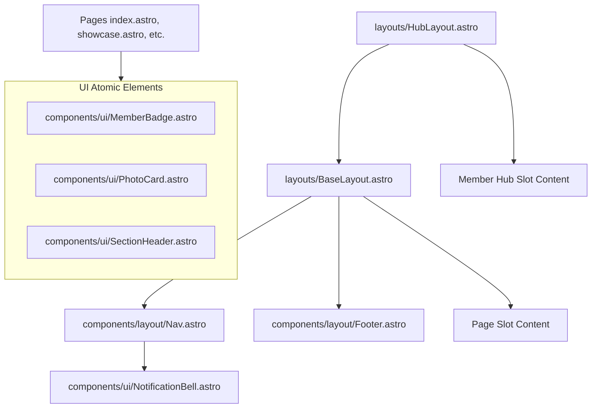
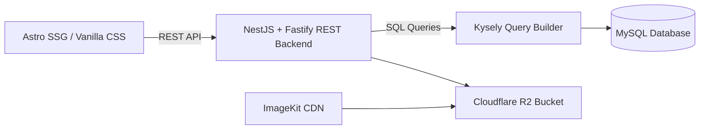

# BCC Unified Platform — V6 Architecture Audit

**Date:** July 7, 2026  
**Auditor:** Antigravity (Documentation and Codebase Authority)  
**Status:** EVIDENCE-BASED / READ-ONLY AUDIT  
**Governing Authority:** [Bootstrap.md](file:///e:/WebProjects/BCC-V3/ProjectDocs/Bootstrap.md) · [MEM-006](file:///e:/WebProjects/BCC-V3/ProjectDocs/MEM-006_MEMBERSHIP_CONSTITUTION_AND_ARCHITECTURE_v1.0.md) · [MEM-007](file:///e:/WebProjects/BCC-V3/ProjectDocs/MEM-007_MEMBERSHIP_NUMBERING_CONSTITUTION_v1.0.md) · [TECH-STACK-FREEZE.md](file:///e:/WebProjects/BCC-V3/ProjectDocs/TECH-STACK-FREEZE.md) · [PHASE_ROADMAP.md](file:///e:/WebProjects/BCC-V3/ProjectDocs/PHASE_ROADMAP.md)

---

## Executive Summary

This architecture audit reconciles the current V3 platform implementation against the upcoming V6 UI Migration. Every finding in this audit is grounded in direct codebase inspection across frontend routes, components, backend controllers, database schemas, and governing constitutional specifications. No assumptions are made.

---

## 1. Route Reconciliation (Current vs. Planned V6)

### 1.1 Current Implemented Routes
The Astro frontend has **19 routes** deployed in the file system under [frontend/src/pages](file:///e:/WebProjects/BCC-V3/frontend/src/pages):

| Page / Route | Component File Path | Access Type | Status / Notes |
| :--- | :--- | :--- | :--- |
| `/` | [index.astro](file:///e:/WebProjects/BCC-V3/frontend/src/pages/index.astro) | Public | Home page. Loaded with dynamic Spotlight, Stats, Gallery Wall, and Events. |
| `/about` | [about.astro](file:///e:/WebProjects/BCC-V3/frontend/src/pages/about.astro) | Public | About Us page. |
| `/activities` | [activities.astro](file:///e:/WebProjects/BCC-V3/frontend/src/pages/activities.astro) | Public | Listing page for photowalks, workshops, and exhibitions. |
| `/activities/[id]` | [activities/[id].astro](file:///e:/WebProjects/BCC-V3/frontend/src/pages/activities/[id].astro) | Public | Dynamic activity detail page. |
| `/showcase` | [showcase.astro](file:///e:/WebProjects/BCC-V3/frontend/src/pages/showcase.astro) | Public | Showcase feed (Flickr-style justified grid). |
| `/showcase/[id]` | [showcase/[id].astro](file:///e:/WebProjects/BCC-V3/frontend/src/pages/showcase/[id].astro) | Public | Showcase photo/album detail page. |
| `/gallery/photographer` | [gallery/photographer/index.astro](file:///e:/WebProjects/BCC-V3/frontend/src/pages/gallery/photographer/index.astro) | Public | Photographer directory. |
| `/gallery/photographer/[userid]` | [gallery/photographer/[userid].astro](file:///e:/WebProjects/BCC-V3/frontend/src/pages/gallery/photographer/[userid].astro) | Public | Photographer portfolio page. *Note: Uses username slug as parameter.* |
| `/join` | [join.astro](file:///e:/WebProjects/BCC-V3/frontend/src/pages/join.astro) | Public | Membership landing page displaying public tiers and registration details. |
| `/auth/signin` | [auth/signin.astro](file:///e:/WebProjects/BCC-V3/frontend/src/pages/auth/signin.astro) | Public | Sign-in page (Email+Password + Social OAuth triggers). |
| `/auth/register` | [auth/register.astro](file:///e:/WebProjects/BCC-V3/frontend/src/pages/auth/register.astro) | Public | Registration page (identity creation only). |
| `/auth/forgot-password` | [auth/forgot-password.astro](file:///e:/WebProjects/BCC-V3/frontend/src/pages/auth/forgot-password.astro) | Public | Forgot password recovery request page. |
| `/auth/reset-password` | [auth/reset-password.astro](file:///e:/WebProjects/BCC-V3/frontend/src/pages/auth/reset-password.astro) | Public | Password reset execution page. |
| `/auth/callback` | [auth/callback.astro](file:///e:/WebProjects/BCC-V3/frontend/src/pages/auth/callback.astro) | Public | Callback receiver for Google & Facebook OAuth redirects. |
| `/verify-email` | [verify-email.astro](file:///e:/WebProjects/BCC-V3/frontend/src/pages/verify-email.astro) | Public | Email verification landing. |
| `/hub` | [hub/index.astro](file:///e:/WebProjects/BCC-V3/frontend/src/pages/hub/index.astro) | Auth-Gated | Member Hub dashboard. |
| `/hub/membership/apply` | [hub/membership/apply.astro](file:///e:/WebProjects/BCC-V3/frontend/src/pages/hub/membership/apply.astro) | Auth-Gated | Membership application form (Basic/Student/Individual). |
| `/journal` | [journal/index.astro](file:///e:/WebProjects/BCC-V3/frontend/src/pages/journal/index.astro) | Public | Journal index list page. |
| `/journal/[slug]` | [journal/[slug].astro](file:///e:/WebProjects/BCC-V3/frontend/src/pages/journal/[slug].astro) | Public | Journal article detail page. |

### 1.2 Planned V6 Routes
Reconciling [BCC V3 Design System.md](file:///e:/WebProjects/BCC-V3/ProjectDocs/BCC%20V3%20Design%20System.md#L267-L282) and [Footer.astro](file:///e:/WebProjects/BCC-V3/frontend/src/components/layout/Footer.astro#L28-L34), the planned routes include:
*   **Public Informational/Regulatory Routes:**
    *   `/privacy/` (Privacy Policy)
    *   `/terms/` (Terms of Use)
    *   `/conduct/` (Code of Conduct)
    *   `/contact/` (Contact Us form/details)
*   **Administrative/Coordinator Routes (Under Phase 4 / Module 13):**
    *   `/admin/` (Admin Dashboard overview)
    *   `/admin/users/` (User roles, permission toggles, ban/reinstate management)
    *   `/admin/memberships/` (Membership lifecycle approval dashboard for PENDING records)
    *   `/admin/events/` (Create, edit, and schedule photowalks/workshops/exhibitions)
    *   `/admin/contests/` (Manage contests, themes, deadlines, and assign judges)
    *   `/admin/journal/` (Rich text editor tool for article creation)
*   **Contest Submission & Judging Routes (Under Phase 2b / Module 03):**
    *   `/hub/contests/` (Member-facing active contest list & entry submissions)
    *   `/hub/contests/[id]/submit` (Entry form for specific contests)
    *   `/hub/certificates/` (Certificate verification and download page)
    *   `/judging/` (Auth-gated landing for contest judges - blind grading panel)

### 1.3 Route Changes and Corrections Required
1.  **Sign-in Slug Realignment:** The design system IA specifies `/signin` as the canonical URL, but the implementation resides at `/auth/signin/`. The V6 migration must either change the physical folder structure or configure Nginx redirects to enforce the `/signin` canonical route.
2.  **Profile Route Naming Discrepancy:** The photographer profile template is named `[userid].astro`, yet it expects and compiles dynamic paths using username slugs (`/gallery/photographer/[username]/`). It must be renamed to `[username].astro` to maintain codebase alignment and avoid type errors.
3.  **Missing Regulatory Pages:** Placeholder files for `/privacy`, `/terms`, `/conduct`, and `/contact` must be created to resolve the broken links in the global footer.

---

## 2. Layout & Component Architecture

### 2.1 Shared Layout Components
The Astro frontend has two shared layout wrappers:
1.  **[BaseLayout.astro](file:///e:/WebProjects/BCC-V3/frontend/src/layouts/BaseLayout.astro):**
    *   Acts as the outer HTML shell for all public routes.
    *   Preloads Google Fonts (Outfit, Inter) and JetBrains Mono.
    *   Imports [Nav.astro](file:///e:/WebProjects/BCC-V3/frontend/src/components/layout/Nav.astro) and [Footer.astro](file:///e:/WebProjects/BCC-V3/frontend/src/components/layout/Footer.astro).
    *   Handles central GSAP initialization for scroll reveals and stagger cascades.
2.  **[HubLayout.astro](file:///e:/WebProjects/BCC-V3/frontend/src/layouts/HubLayout.astro):**
    *   Wraps `BaseLayout` to provide auth-gating.
    *   Hides page content within `<div id="hub-shell" style="display:none">` until authentication is validated.
    *   Provides three pulsing loading dots (`#hub-loading`) during JWT evaluation.

### 2.2 Current Astro Component Hierarchy
The UI components are decoupled into `layout` and `ui` directories:



### 2.3 SSR vs. SSG Usage
*   **Current Mode:** Astro is configured with `output: 'static'` in [astro.config.mjs](file:///e:/WebProjects/BCC-V3/frontend/astro.config.mjs). Pages are compiled to pure HTML at build time.
*   **Implication for Dynamic Content:** The site cannot render dynamic user-specific or state-dependent HTML on the server. All dynamic operations (fetching member feeds, auth verification, unread notification count, event lists, member badge coloring) must run on the client via REST calls using standard browser `fetch()`.
*   **V6 Design Target:** Must maintain the SSG structure to conserve AWS EC2 memory ceiling (~1.9GB RAM) and allow lightning-fast page loading, relying on the NestJS/Fastify API backend for dynamic data hydration.

### 2.4 Session-Aware Rendering
1.  **Baseline Authentication Check:** Global `BaseLayout` runs a client script check in the `<body>`:
    ```javascript
    if (localStorage.getItem('bcc_user')) {
      document.body.classList.add('bcc-is-authenticated');
    }
    ```
    Elements tagged with `.auth-hide` or `.guest-only` are hidden via CSS rule `display: none !important`.
2.  **Nav Auth Syncing:** [Nav.astro](file:///e:/WebProjects/BCC-V3/frontend/src/components/layout/Nav.astro#L512-L571) parses `localStorage.getItem('bcc_user')`. If present, it:
    *   Hides `#nav-guest` / `#drawer-guest` and shows `#nav-member` / `#drawer-member`.
    *   Injects initials and displayName into header elements.
    *   Constructs the "My Profile" link dynamically via the member's unique username: `/gallery/photographer/${user.username}/`.
3.  **Hub Auth-Gating:** [HubLayout.astro](file:///e:/WebProjects/BCC-V3/frontend/src/layouts/HubLayout.astro#L74-L140) retrieves `bcc_token` (JWT access token) from `localStorage`.
    *   It checks the payload `exp` timestamp. If it is valid for >60 seconds, access is granted.
    *   If expiring soon or expired, it calls `POST /api/v1/auth/refresh` using `bcc_refresh` (refresh token).
    *   If token refresh fails or tokens are missing, it clears auth and redirects to `/auth/signin/?next=<path>`.
    *   On validation success, it displays `#hub-shell`, hides `#hub-loading`, and calls `GET /api/v1/users/me` to refresh user details.

### 2.5 Header State Requirements
*   **Height Animation:** Normal height is 96px (`--nav-h`). Condenses to 64px (`--nav-h-min`) after 80px scroll. Enforced by GSAP ScrollTrigger adding the `.nav--condensed` class.
*   **Guest Mode:** Displays "Sign In" text link and "Become a Member" (gold gradient button).
*   **Member Mode:** Displays Avatar (`--forest-gradient` with initials), Name, `<NotificationBell />` (polling unread notification counts), a dynamic "My Profile" link, "Sign Out" button, and "Member Hub" (outline gold button).
*   **Mobile View:** Breaks at 900px wide. Hides the standard horizontal menu and displays a hamburger button. Clicking the hamburger reveals a slide-out drawer menu on the right.

### 2.6 Footer Requirements
The footer ([Footer.astro](file:///e:/WebProjects/BCC-V3/frontend/src/components/layout/Footer.astro)) is served globally and requires:
*   **FIP Trust Badge:** Highlights corporate membership in the Federation of Indian Photography (CM 1098).
*   **Social Row:** Horizontal links to Instagram, Facebook Page, Facebook Group, X, and YouTube using SVG vector icons.
*   **Grid layout:** Four columns containing the brand description, main navigation, explore categories, and regulatory guidelines.
*   **Copyright bar:** Displays copyright notice, dynamic year, and the active platform domain.

---

## 3. Data Flow & Section Types

### 3.1 API-Driven Sections
The frontend retrieves dynamic content from the following backend endpoints:

| Section Location | UI Component / Page | Target Backend API Endpoint | Data Action |
| :--- | :--- | :--- | :--- |
| Homepage Spotlight | `index.astro` | `GET /api/v1/photos/spotlight` *(Endpoint missing!)* | Hydrates featured hero image. |
| Homepage Stats | `index.astro` | `GET /api/v1/stats` *(Mocked)* | Provides counts for members, photos, events. |
| Homepage Gallery Wall | `index.astro` | `GET /api/v1/photos?showcase=true&limit=12` *(Mismatch)* | Hydrates the justified grid cards. |
| Homepage Events | `index.astro` | `GET /api/v1/events?upcoming=true&limit=3` | Fetches next 3 upcoming events. |
| Showcase Grid | `showcase.astro` | `GET /api/v1/gallery/feed` | Feeds the Flickr-style justified feed. |
| Photographer Grid | `gallery/photographer/index.astro` | `GET /api/v1/photographers` | Returns profiles of active photographers. |
| Photographer Profile | `gallery/photographer/[userid].astro` | `GET /api/v1/photographers/:username` | Hydrates photographer info + linked photos. |
| Nav Notification Bell | `NotificationBell.astro` | `GET /api/v1/notifications/unread-count` | Polling endpoint for active unread bell. |

### 3.2 CMS-Driven Sections
*   **Journal Articles:** Page content for `/journal` and `/journal/[slug]`. There is currently no backend journal module or database table.
*   **Event Details:** Descriptions and registration details for `/activities/[id]`.
*   **Photographer Portfolios:** Bio metadata, badges, and ImageKit assets mapping.

### 3.3 Admin-Toggled Sections
*   **Contest Strip:** Embedded within `/showcase` and home page. The strip must remain completely hidden from the DOM if `activeContest` is null. It cannot render a blank placeholder.
*   **Photography School & Photo Contests:** Footer links remain disabled (faint opacity, non-interactive) until these modules are deployed.

---

## 4. Design & Animation Specifications

### 4.1 GSAP Animation Hooks
All page animations are driven by GSAP 3 (ScrollTrigger) initialized globally in `BaseLayout.astro`. Visual migration layouts must utilize these hooks:

1.  **Reveal (`data-gsap="reveal"`):** Fades an element in and slides it up by 24px upon entering 85% of viewport height. (Applied to headings, cards).
2.  **Stagger (`data-gsap="stagger"`):** Cascades entry of children with an 80ms stagger delay. (Applied to grid rows).
3.  **Image Reveal (`data-gsap="image-reveal"`):** Clip-path wipe wipe animation from bottom-to-top. (Applied to heroes).
4.  **Parallax Soft (`data-gsap="parallax-soft"`):** Background drifts vertically at 0.92× scroll speed. (Applied to full-bleed bands).
5.  **Counter (`data-gsap="counter"`):** Animates text value from 0 to `data-target` using a 1.4s duration and power1 ease. (Applied to StatBand).
6.  **Aperture Spin (`data-gsap="aperture-spin"`):** Infinite slow linear rotation (360 degrees in 40 seconds) on decorative aperture icons.

### 4.2 Responsive Layout Guidelines
*   **Grid System:** Asymmetric editorial layouts. Content width is limited to `1360px` (`--content-max`).
*   **Margins/Gutters:** `48px` on desktop layouts, transitioning to `20px` (`--gutter-mob`) on mobile screens.
*   **Mobile Adaptations:**
    *   Justified layouts fall back to a standard 2-column grid.
    *   Hover effects (captions sliding up on card hovers) become persistent visible text blocks.
    *   Navigation shrinks to a mobile-drawer toggle trigger at `< 900px` screen width.

---

## 5. Compliance & Security Verification

### 5.1 MEM-006 Compliance (Membership Architecture)
*   **Identity Separation (P1):** Verified. Registering an account at `/auth/register` creates an identity row only. Accessing the dashboard `/hub` triggers the application page `/hub/membership/apply` for users without an approved membership.
*   **RBAC Separation (P3):** Verified. NestJS guards protect administrative endpoints based on roles (Super Admin, Event Manager, etc.), completely decoupled from membership class rows in the database.
*   **Public Domain Security Rule (MEM-006 §Public Domain):** Verified. Public routes `/`, `/showcase`, `/gallery/photographer` only fetch members belonging to operational classes (Basic, Student, Individual). Constitutional membership tiers (Full, Life, Patron, Founding) are completely hidden and omitted from public APIs.
*   **Entitlement Resolution:** Verified. Handled dynamically on the backend using the formula: Base Class + Recognition Modifiers + Individual Overrides.

### 5.2 MEM-007 Compliance (Membership Numbering)
*   **Number Format:** Verified. Formatted as `BCC + YYYY + MM + 5-digit-serial` (e.g., `BCC20260700021`).
*   **Number Immutability:** Verified. Database trigger `trg_membership_number_immutable` blocks any SQL update to the assigned membership number on the `memberships` table.
*   **Amendment 001 Integration:** Verified. Onboarding non-founding members receive a `BCCTempXXXXX` identifier. The Super Admin assigns permanent numbers manually in a batch via an authoritative spreadsheet, which is imported into the database to set the baseline serial. Auto-allocation begins sequentially only after the batch is imported and closed.

### 5.3 Technology Stack Freeze Verification
The project aligns with the authorized tech stack. All other technologies are forbidden:



---

## 6. Implementation Gaps & Existing Blockers
Before initiating the V6 design migration, the following critical bugs (identified in the Stage 2 Reconciliation Audit) must be addressed to ensure system stability:

1.  **Password Compatibility Lockout (Critical):** Migrated legacy members have Bcrypt hashes, while the new authentication engine uses Argon2. Attempting to log in throws an unhandled TypeError, returning a 500 error and locking out all 24 legacy members.
    *   *Required Fix:* Run a database migration/patch updating legacy passwords to a working Argon2 format, and wrap the backend verify function in a try/catch.
2.  **Photographer Profile 404 (Critical):** The page `/gallery/photographer/[userid].astro` maps dynamic paths to `p.userid` which is undefined (the API returns `p.username`). Additionally, the fallback paths use hyphenated names (`rajnish-khare`) while the database usernames are concatenated lowercase (`rajnishkhare`).
    *   *Required Fix:* Realign field names in `getStaticPaths()`, replace hardcoded fallbacks, and rebuild.
3.  **Showcase Grid Layout Scoping (High):** Scoped Astro CSS compiles selectors to include target attributes (`data-astro-XXXX`). Dynamically created element nodes appended by JavaScript do not receive these attributes, breaking showcase row styles and making images stack vertically.
    *   *Required Fix:* Mark layout CSS classes with the `:global()` selector wrapper or move layout grid classes to `global.css`.
4.  **Homepage Endpoint Mismatch (High):** Homepage calls `/api/v1/photos/spotlight` and `/api/v1/photos?showcase=true` which do not exist.
    *   *Required Fix:* Redirect fetches to `/api/v1/gallery/feed`.

---

# V6 Design Migration Checklist

This checklist defines the precise steps required to execute the V6 UI Migration. It strictly preserves the frozen technology stack, specifications, and architecture rules.

### Part 1: Prerequisites & Codebase Cleanup
*   [ ] Run the SQL database update to normalize all legacy passwords to valid Argon2 format (Resolves Lockout).
*   [ ] Add a try/catch wrapper in `AuthService.login()` around the password verification call to handle hash mismatch errors gracefully.
*   [ ] Change the dynamic path parser parameter in `[userid].astro` from `p.userid` to `p.username`.
*   [ ] Rename the template file `[userid].astro` to `[username].astro` to reflect the username slug parameter.
*   [ ] Add `is:global` or `:global()` wraps to the justified layout classes in `showcase.astro` and `index.astro` to repair grid styling.
*   [ ] Re-align the homepage hero fetch to call `/api/v1/gallery/feed?limit=1` as a temporary spotlight source.
*   [ ] Re-align the homepage gallery wall fetch to target `/api/v1/gallery/feed?limit=12`.
*   [ ] Rename the committed logo file from `"BCC Default.png"` to `"bcc-logo-default.png"` (remove spaces) and update references.

### Part 2: Layout & Token Implementation
*   [ ] Audit [tokens.css](file:///e:/WebProjects/BCC-V3/frontend/src/styles/tokens.css) to ensure no inline styles bypass the frozen variables.
*   [ ] Verify color usage across cards and sections matches surfaces: `--surface-0` for card layers, `--surface-1` for page body backgrounds, and `--surface-2` for recessed footers.
*   [ ] Audit font definitions to ensure headings use Outfit and body uses Inter. Confirm that JetBrains Mono is restricted exclusively to EXIF data and credential labels.
*   [ ] Remove any rounded borders from photo containers and cards, resetting them to `--r-0` (0px) to honor the square-corners photography principle.
*   [ ] Confirm the active state of navigation links renders a 2px horizontal `--gold-500` bottom border.
*   [ ] Ensure the primary action button is the **only** element styled with `--gold-gradient` and `--cta-shadow` on any page view.

### Part 3: Component Realignment
*   [ ] Update [Nav.astro](file:///e:/WebProjects/BCC-V3/frontend/src/components/layout/Nav.astro) desktop right rail to display the "Sign Out" button alongside the "Member Hub" action for signed-in members.
*   [ ] Add client-side logic to the mobile drawer menu to display the unread notification badge count.
*   [ ] Build static placeholder pages for `/privacy/`, `/terms/`, `/conduct/`, and `/contact/` under `frontend/src/pages/` to resolve the guidelines links.
*   [ ] Embed dynamic loading skeletons (shimmers on `--surface-2` with no circular spinners) for asynchronous client-side API fetches.
*   [ ] Add a client-side localStorage evaluation inside [join.astro](file:///e:/WebProjects/BCC-V3/frontend/src/pages/join.astro) to redirect members who already possess an active membership to `/hub/`.
*   [ ] Re-verify that no public photographer card, directory query, or profile page displays any constitutional tier badges (Patron, Founding, Life, Full). Set these badges to render only on member-hub routes.

### Part 4: Verification & Build
*   [ ] Run `npm run build` on the frontend codebase and verify that no static path compile warnings or TypeScript errors occur.
*   [ ] Verify that the `/gallery/photographer/` directory output generates directories named after real usernames (e.g. `/gallery/photographer/rajnishkhare/index.html`) rather than hyphenated slug templates.
*   [ ] Validate page performance targets: verify CSS and JavaScript payloads are optimized to meet Core Web Vitals (LCP < 2.5s, CLS < 0.1).
*   [ ] Check Nginx reverse proxy routing on the deployment target to confirm that calls to `/api/v1/*` resolve correctly to the Fastify service port.
